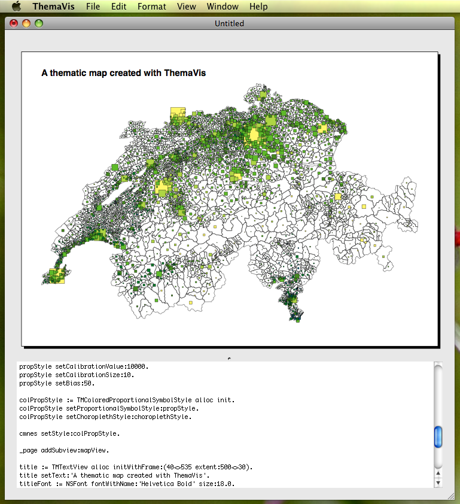

# ThemaVis: a thematic mapping application for Mac OS X

ThemaVis allows for creating different kinds of thematic maps, namely choropleth maps, proportional symbol maps and coloured proportional symbol maps. Maps can be exported into PDF files.

ThemaVis takes standard ESRI Shapefiles as input. Several layers can of course be displayed, and several maps fitted on a single page.

This screenshot shows an example map created with ThemaVis:

Beside maps, text panes, legends, and scales can also be fitted on a map. Every single command that is executed through the graphical user interface is recorded as a script command and is accessible to the user. Automatic map creating is becoming easier in this way. If one needs to create a series of identical looking thematic maps, this can be achieved through some scripting in ThemaVis.

## Contact

Please feel free to contact the author:
Christian Kaiser <ck@361degres.ch>

